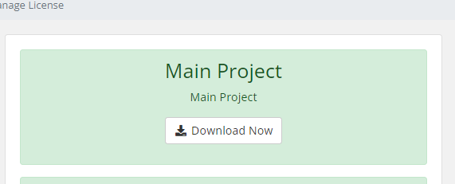
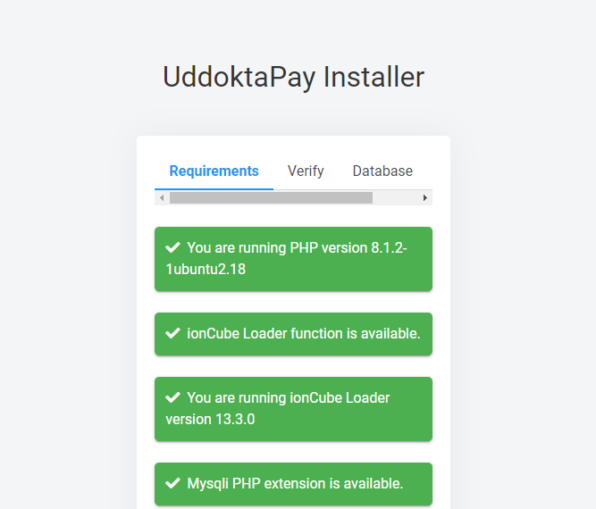
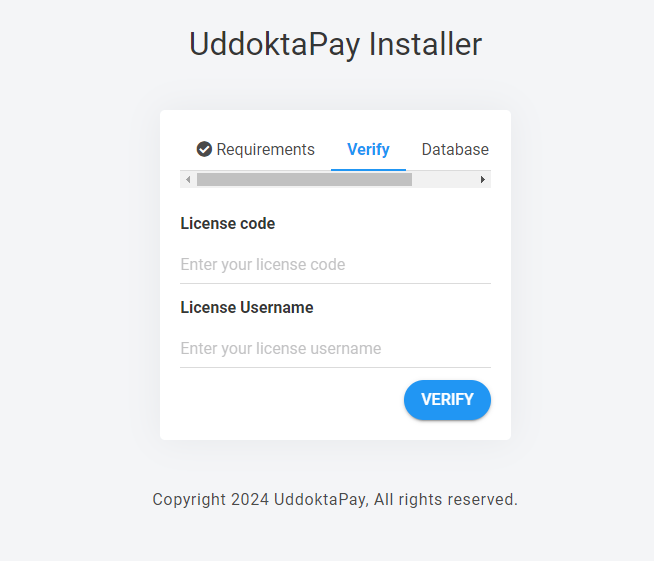
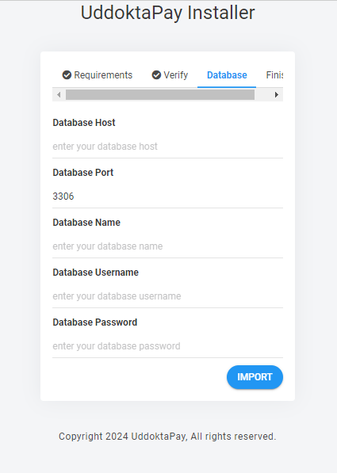

# UddoktaPay Installation Guide

This guide will help you set up UddoktaPay, a PHP-based payment automation service, on a VPS (Virtual Private Server) with Ubuntu, Nginx, and MySQL. UddoktaPay requires PHP and several PHP extensions to function properly.

## Prerequisites

- UddoktaPay license
- Subdomain of the domain you provided while buying the license.
- VPS (Virtual Private Server) running Ubuntu
- SSH access to your VPS
- Basic knowledge of Linux command line

## Steps to Install UddoktaPay

### 1. Download The Main Project from your uddoktapay account

Download The Main Project from your uddoktapay account



### 2. Copy UddoktaPay from you local machine to VPS :

example : 

```
scp -r  C:\Users\user\Downloads\UddoktaPay.zip root@123.45.67.89:/var/www
```

and unzip it running `cd /var/www` and `unzip UddoktaPay.zip`.
to delete the zip file run `rm UddoktaPay.zip`


### 3. Install PHP and Required Extensions:

Update Package Lists:

```
sudo apt update
```
Install PHP and Required Extensions:

```
sudo apt install php-fpm php-mysql
```

Verify PHP Installation:

```
php -v
```

### 4. Configure nginx for PHP

1. #### Create a Server Block for Your Subdomain:
You may already have nginx server blocks configured. If not, create one specifically for your PHP project in a file like `/etc/nginx/sites-available/subdomain.example.com:`

```
server {
    listen 80;
    server_name subdomain.example.com;
    root /var/www/UddoktaPay; # Path to your PHP project's directory

    index index.php index.html index.htm;

    location / {
        try_files $uri $uri/ /index.php?$query_string;
    }

    location ~ \.php$ {
        include snippets/fastcgi-php.conf;
        fastcgi_pass unix:/run/php/php8.1-fpm.sock;  # Adjust version if needed
    }

    location ~ /\.ht {
        deny all;
    }
}

```

#### 2. Enable the Server Block:
Enable the server block by creating a symbolic link to sites-enabled:

```
sudo ln -s /etc/nginx/sites-available/subdomain.example.com /etc/nginx/sites-enabled/
```


#### 3. Test Your Setup

Access your subdomain `(http://subdomain.example.com)` in a web browser.


If you encounter a page containing an error like this:

```
ionCube Loader function is missing! UddoktaPay requires ionCube Loader function to run, Please check and enable the extension or Contact with hosting provider.
```

Your connection to the subdomain and the UddoktaPay project is established.

### 5. Resolving issues

- follow this file to set up  `ionCube Loader` for UddoktaPay

[set_up_ionCube.md](set_up_ionCube.md)

- here are some error example you may encounter : [possible_error_example.md](possible_error_example.md)


### 6. Verify UddoktaPay license 

after resolving the issues you should see this page : 



clicking the next button you should see this page : 



here you will provide `License Key` and `License Username`


### 7. Set up database

after verifying you will need to provide database related info : 



set up your mysql database following this file : [set_up_mysql](set_up_mysql.md)

and fill in the database details as requested on the form:
   - **Database Host:** Provide the hostname or IP address of your MySQL/MariaDB server. If it's on the same server where your PHP project is hosted, use `localhost`.
   - **Database Port:** Usually `3306` unless your database server is configured differently.
   - **Database Name:** Enter the name of the database you've created for your PHP project.
   - **Database Username:** Enter the username that has access to the database.
   - **Database Password:** Enter the password associated with the database username.


This guide should help you set up UddoktaPay on your VPS. If you encounter any issues, refer to the respective documentation or seek assistance from the community or support channels.